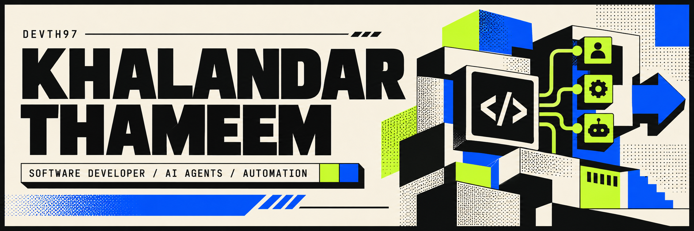

### 01 / THE BUILDER

I’m **Khalandar**, a software developer exploring the intersection of **applications, AI agents, and automation**. I turn everyday problems into practical tools, with a growing focus on understanding what an agent does between the request and the result.

> **Building with intent:** useful software, visible execution, and people in control.

<table>
<tr>
<td width="33%" valign="top"><h3>⌘ &nbsp; Build</h3>
Applications and tools that make everyday work simpler.
</td>
<td width="33%" valign="top"><h3>◈ &nbsp; Automate</h3>
Local AI agents that coordinate tasks, projects, and workflows.
</td>
<td width="33%" valign="top"><h3>◎ &nbsp; Observe</h3>
Intent, tool calls, state changes, and the audit trail behind a result.
</td>
</tr>
</table>

### 02 / SELECTED WORK

<table>
<tr>
<td width="50%" valign="top">
<h3>◈ &nbsp; Archify</h3>

<strong>Make systems easier to understand.</strong>

An agent skill for architecture, workflow, sequence, and data-flow diagrams. Self-contained HTML, motion, and crisp export.

<code>JavaScript</code> <code>Agent Skills</code> <code>Visualization</code>

<a href="https://github.com/Devth97/archify-architecture-visualizer">Explore the project →</a>
</td>
<td width="50%" valign="top">
<h3>↗ &nbsp; Cardio Surfer</h3>

<strong>Playful ideas, working software.</strong>

A TypeScript game project: another side of my work, bringing interactive experiences to life.

<code>TypeScript</code> <code>Interactive Apps</code>

<a href="https://github.com/Devth97/CARDIO-SURFER">Explore the project →</a>
</td>
</tr>
</table>

<a href="https://github.com/Devth97?tab=repositories">See all repositories ↗</a>

### 03 / TOOLBOX & EXPLORATIONS

**Currently exploring** &nbsp; \ AI agent coordination · Workflow automation · Agent observability · Reusable prompts & playbooks

### 04 / NOW & NEXT

- **Building:** a local AI agents office to coordinate work from my laptop.
- **Investigating:** how to make agent execution traceable and auditable.
- **Creating:** practical prompts and playbooks for everyday AI workflows.

<strong>Background & education</strong>

 

- ProRack Storage Solutions India Pvt. Ltd.
- Vivekananda College of Engineering & Technology, Puttur · 2022–2026.
- Mysore, Karnataka, India.

---

<strong>Have an idea worth building?</strong> Let’s talk about software, AI agents, or practical automation.  <a href="https://www.linkedin.com/in/khalandar-thameem/">Connect on LinkedIn ↗</a>

